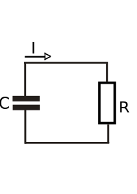
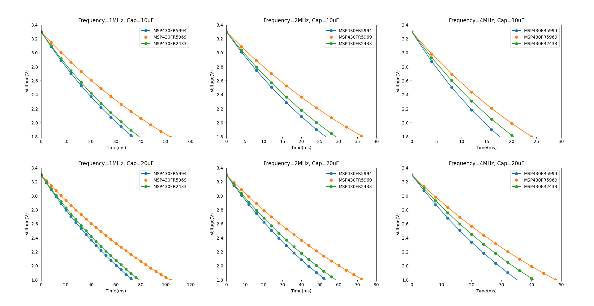

# Basic

### RC circuit

A **resistor–capacitor circuit** (**RC circuit**), or **RC filter** or **RC network**, is an electric circuit composed of resistors and capacitors.



### RC time constant

The **RC time constant**, also called tau, the **time constant (in seconds)** of an RC circuit, is equal to the product of the **circuit resistance (in ohms)** and the circuit **capacitance (in farads)**, i.e.
$$
\tau =RC
$$

### Charging

Charging toward applied voltage (initially zero voltage across capacitor, constant $V_0$ across resistor and capacitor together) $V_0$:
$$
V(t)=V_0(1-e^{-t/\tau})
$$

### Discharging

Discharging toward zero from initial voltage (initially $V_0$ across capacitor, constant zero voltage across resistor and capacitor together) $V_0$:
$$
V(t)=V_0(e^{-t/\tau})
$$


# Equivalent resistance of MCU

We first give the **maximum current (in $\mu\text{A}$)** that each development board running the testbench at different frequency (MCLK & SMCLK) (**constant power supply, ADC sampling interval is 500us**):

|   Frequency   | FR5994 (in $\mu\text{A}$) | FR5969 (in $\mu\text{A}$) | FR2433 (in $\mu\text{A}$) |
| :-----------: | :-----------------------: | :-----------------------: | :-----------------------: |
| $1\text{MHz}$ |          $540.6$          |          $422.6$          |          $504.3$          |
| $2\text{MHz}$ |          $747.5$          |          $598.8$          |          $678.4$          |
| $4\text{MHz}$ |         $1135.0$          |          $908.6$          |          $973.1$          |

Under EnergyTrace, **the voltage of FR5994 is $3.276\text{V}$, the voltage of FR5969 is $3.600\text{V}$, and the voltage of FR2433 is $3.270\text{V}$**.

Calculate the equivalent resistor size from voltage and current:

|   Frequency   | FR5994 (in $\ohm$) | FR5969 (in $\ohm$) | FR2433 (in $\ohm$) |
| :-----------: | :----------------: | :----------------: | :----------------: |
| $1\text{MHz}$ |       $6043$       |       $8518$       |       $6484$       |
| $2\text{MHz}$ |       $4370$       |       $6012$       |       $4820$       |
| $4\text{MHz}$ |       $2878$       |       $3962$       |       $3360$       |

> ```
> >>> I = [540.6, 747.5, 1135.0, 422.6, 598.8, 908.6, 504.3, 678.4, 973.1]
> >>> U = [3.267, 3.267, 3.267, 3.6, 3.6, 3.6, 3.27, 3.27, 3.27]
> >>> length = 9
> >>> R = [u / i * 1e6 for u, i in zip(U, I)]
> >>> R
> [6043.285238623751, 4370.568561872909, 2878.4140969162995, 8518.693800283956, 
>  6012.024048096193, 3962.139555359894, 6484.235574063058,  4820.165094339623, 
>  3360.394615147467 ]
> ```

# Discharging Curve

Under Power Trace, the supply voltage is unified to $3.3\text{V}$.

> 代码见 [sampling_interval.py](sampling_interval.py) ，图片见 [discharge_curve.png](discharge_curve.png) 。



在1MHz下，当电容大小分别为10uF、20uF和40uF时，电容在40ms、80ms和150ms的时间内从3.3V下降到MCU理论最低运行电压1.8V。Reasonable sampling interval

假设供电电压为$V_s$，MCU最低运行电压为$V_\text{min}$，电容放电时间为$T$，期望的ADC分辨率在$\Delta U$以内（即在电容放电时，ADC两次测量电压之差不会大于$\Delta U$），ADC采样的间隔为$\Delta T$，那么就有
$$
\Delta T \cdot \frac{V_s-V_\text{min}}{T}<\Delta U
$$
即
$$
\Delta T<\frac{T\Delta U}{V_s-V_\text{min}}
$$
在Just-In-Time间歇计算模型下，如果系统备份失败，那么所有的执行结果都会丢失，另外，ADC测量电压本身也会带有波动。因此ADC的分辨率应该是越高越好的。这里取ADC的分辨率为$\Delta U=0.01\text{V}$。

在1MHz来说为例，放电速率最慢时（Frequency=1MHz，Cap=20uF，MSP430FR5969），$T=0.1\text{s}$。将$V_s=3.3V,V_\text{min}=1.8V$带入，就可以得到
$$
\Delta T<\frac{0.1\times 0.01}{3.3-1.8}=0.000667s
$$
即$667\mu\text{s}$。

而如果是放电速率最快时，$T=0.04s$，同样可以得到
$$
\Delta T=\frac{0.04\times0.015}{3.3-1.8}=0.0004s
$$
即$400\mu\text{s}$。

而对于2MHz甚至4MHz以上来说，ADC的采样间隔还需要更短，例如，如果$T=0.02s$，$\Delta T=0.0002s$，即每$200\mu\text{s}$就需要进行一次ADC采样。
